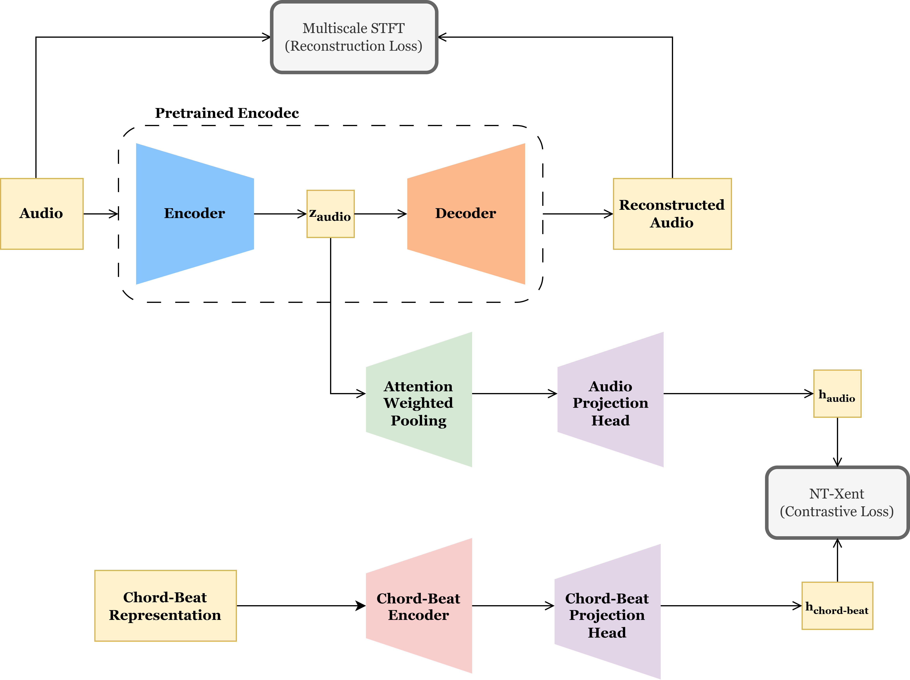

<<<<<<< HEAD
MusicConRec model development

=======
# MusicConRec: Contrastive Reconstruction for Music Representations

A PyTorch implementation adapting the **ConRec** framework from computer vision to music, combining **audio reconstruction** with **contrastive learning** between audio and chord-beat embeddings.

**Paper:** "Towards Fine-grained Visual Representations by Combining Contrastive Learning with Image Reconstruction and Attention-weighted Pooling" (Dippel et al., ICML 2021 Workshop)

## Key Innovation

Standard contrastive learning works on augmented versions of the **same image**. MusicConRec extends this to music by contrasting **different modalities**:
- **Audio embeddings** (from waveform)
- **Chord-beat embeddings** (from symbolic music information)

This allows the model to learn representations that capture both the audio quality AND the harmonic/rhythmic structure of music.

## Architecture Overview

```
┌─ Audio Branch ────────────────┐
│  EncodecModel (frozen)        │
│  → Code Embedding             │
│  → Attention Pooling          │
│  → z_audio (128-dim)          │  ── NT-Xent Contrastive Loss ──┐
└───────────────────────────────┘                                 ├─→ Combined Loss
┌─ Chord-Beat Branch ───────────┐                                 │
│  Transformer Encoder           │                                │
│  → Attention Pooling          │                                 │
│  → z_chord (128-dim)          │  ── Reconstruction Loss (STFT) ──┘
└───────────────────────────────┘

Loss = λ_contrastive * L_ntxent + λ_recon * L_stft
```

## Installation

```bash
git clone <repo-url>
cd vqvae-contrastive-music-encoder

pip install -r requirements.txt
```

### Requirements
- Python 3.8+
- torch >= 2.0.0
- torchaudio >= 2.0.0
- transformers >= 4.30.0
- tensorboard

## Quick Start

### 1. Prepare Data
```bash
python split_dataset.py  # Creates train/val splits from MusicBench
```

### 2. Configure Training
Edit `training_hyperparam.json`:
```json
{
    "epochs": 30,
    "batch_size": 16,
    "learning_rate": 0.0001,
    "lambda_contrastive": 1.0,    ← Weight for contrastive loss
    "lambda_recon": 0.05          ← Weight for reconstruction loss
}
```

### 3. Train Model
```bash
# Start training
python main.py train

# Monitor with TensorBoard
tensorboard --logdir ./runs
```

### 4. Evaluate
```bash
python main.py eval
```

### 5. Inference
```python
from inference import load_best_model
import torchaudio

# Load pre-trained model
model = load_best_model()

# Load audio
audio, sr = torchaudio.load("music.wav", normalize=False)
audio = audio / audio.abs().max()

# Get embedding
embedding = model.get_audio_embedding(audio.unsqueeze(0))
print(f"Audio embedding: {embedding.shape}")  # (1, 128)

# Reconstruct
recon = model.reconstruct_audio(audio.unsqueeze(0))
torchaudio.save("reconstructed.wav", recon, sr)
```

## Project Structure

```
├── model/
│   ├── model.py                    # Main MusicConRec architecture
│   ├── chordbeat_encoder.py        # Transformer-based chord encoder
│   ├── attention_weighted_pooling.py
│   └── projection.py
├── loss/
│   ├── ntxent.py                   # Contrastive loss (NT-Xent)
│   └── recon.py                    # Reconstruction loss (Multi-scale STFT)
├── preprocessing/
│   ├── audio_preprocess.py
│   ├── chord_beat.py
│   └── augment.py
├── dataset.py                       # MusicBench dataset loader
├── train.py                         # Training loop
├── eval.py                          # Evaluation script
├── inference.py                     # Model inference utilities
├── main.py                          # Entry point
├── IMPLEMENTATION_GUIDE.md          # Detailed technical guide
├── TRAINING_CHECKLIST.md           # Pre-training verification
└── training_hyperparam.json        # Hyperparameters
```

## Loss Functions

### Contrastive Loss (NT-Xent)
Normalized Temperature-Scaled Cross Entropy between audio and chord-beat embeddings:
```
L_ntxent = -log(exp(sim(z_audio, z_chord)/τ) / Σ exp(sim(z_audio, z_k)/τ))
```

**Parameters:**
- Temperature (τ): 0.07
- Bidirectional: Audio→Chord + Chord→Audio

### Reconstruction Loss (Multi-Scale STFT)
Frequency-domain loss comparing original and reconstructed audio:
```
L_stft = Σ (ScectralConvergence + LogMagnitude) over 3 scales
```

**Scales:**
- FFT: [1024, 512, 256]
- Hop: [256, 128, 64]
- Win: [1024, 512, 256]

## Model Components

### Audio Branch
- **Encoder:** Facebook's EncodecModel (pre-trained, frozen)
- **Embedding:** Learnable code embeddings (1024 codebook size)
- **Pooling:** Attention-weighted temporal pooling
- **Projection:** 2-layer MLP to 128-dim space

### Chord-Beat Branch
- **Input:** 13-dimensional chord-beat representation per timestep
- **Encoder:** Transformer (4 layers, 4 heads, d_model=128)
- **Pooling:** Attention-weighted temporal pooling  
- **Projection:** 2-layer MLP to 128-dim space

## Hyperparameters

| Parameter | Value | Notes |
|-----------|-------|-------|
| Epochs | 30 | Early stopping at 5 epochs without improvement |
| Batch size | 16 | Adjust based on GPU memory |
| Learning rate | 0.0001 | Adam optimizer |
| Gradient clipping | 1.0 | Prevents exploding gradients |
| Temperature (τ) | 0.07 | Contrastive loss sharpness |
| λ_contrastive | 1.0 | Weight for contrastive loss |
| λ_recon | 0.05 | Weight for reconstruction loss |

## Training

### Data Format
- **Audio:** 24 kHz, mono, normalized to [-1, 1]
- **Chord-Beat:** Temporal sequence (T, 13) aligned with audio
- **Dataset:** MusicBench JSON with file locations and annotations

### Optimization
- **Optimizer:** Adam (lr=0.0001)
- **Scheduler:** None (constant learning rate)
- **Gradient clipping:** max_norm=1.0
- **Checkpointing:** 
  - Best model: saved when validation loss improves
  - Final model: saved after all epochs

### Monitoring
TensorBoard logs all metrics:
- Train/Val total loss
- Train/Val contrastive loss
- Train/Val reconstruction loss

Access via: `tensorboard --logdir ./runs`

## Expected Results

### Convergence Behavior
- **Contrastive Loss:** Decreases as embeddings align
- **Reconstruction Loss:** Decreases as audio quality improves
- **Balance:** Depends on λ weights

### Tuning Tips
1. If reconstruction is poor → increase `lambda_recon`
2. If contrastive plateaus → decrease `lambda_recon` or increase learning rate
3. If training is unstable → reduce learning rate or increase gradient clipping

## Evaluation

### Downstream Tasks
The pre-trained encoder can be used for:
1. **Music Classification:** Linear probe evaluation
2. **Similarity Search:** Embedding-based retrieval
3. **Reconstruction Quality:** PESQ, STOI metrics

### Representation Quality Metrics
- **Uniformity:** Embeddings spread across space
- **Alignment:** Similar audio-chord pairs are close
- **Separation:** Dissimilar pairs are far apart

## Differences from Original ConRec

| Aspect | Original ConRec | MusicConRec |
|--------|-----------------|------------|
| Domain | Vision (images 224×224) | Audio (waveforms 24kHz) |
| Encoder | U-Net (trained end-to-end) | EncodecModel (frozen) |
| Contrastive pairs | Augmented versions of same image | Different modalities |
| Reconstruction target | Raw pixels (MSE) | Audio codes (STFT) |
| Pooling | Spatial 2D attention | Temporal 1D attention |
| Feature extraction | Fine-grained visual patterns | Harmonic/rhythmic patterns |

## Documentation

- **[IMPLEMENTATION_GUIDE.md](IMPLEMENTATION_GUIDE.md):** Detailed architecture and design decisions
- **[TRAINING_CHECKLIST.md](TRAINING_CHECKLIST.md):** Pre-training verification and troubleshooting

## Troubleshooting

### NaN Loss
- **Cause:** Audio not normalized or extreme values
- **Fix:** Verify `audio = audio / audio.abs().max()`

### Memory Error
- **Cause:** Batch size too large for GPU
- **Fix:** Reduce batch_size in training_hyperparam.json

### Reconstruction Loss Very High
- **Cause:** EncodecModel format mismatch
- **Fix:** Verify audio is 24 kHz mono (1, T)

### Contrastive Loss Not Decreasing
- **Cause:** Learning rate too low or embedding dimension mismatch
- **Fix:** Check learning rate and ensure z_audio/z_chord are (B, 128)

## Citation

If you use this code, please cite:

```bibtex
@inproceedings{dippel2021conrec,
  title={Towards Fine-grained Visual Representations by Combining Contrastive Learning with Image Reconstruction and Attention-weighted Pooling},
  author={Dippel, Jonas and Vogler, Steffen and Höhne, Johannes},
  booktitle={ICML 2021 Workshop: Self-Supervised Learning for Reasoning and Perception},
  year={2021}
}
```

## License

MIT

## References

- ConRec paper: https://arxiv.org/abs/2104.04323
- EncodecModel: https://huggingface.co/facebook/encodec_24khz
- SimCLR: https://arxiv.org/abs/2002.05709


>>>>>>> 6c68104e (copilot changes)
